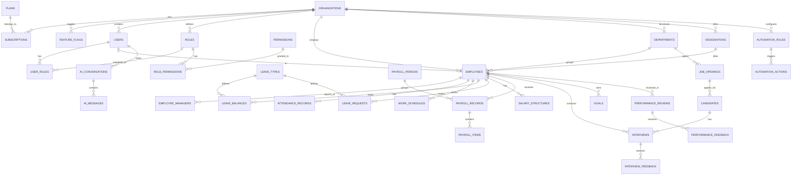

# HRMS SaaS Database ERD

```mermaid
erDiagram
    %% Platform
    ORGANIZATIONS ||--o{ SUBSCRIPTIONS : has
    PLANS ||--o{ SUBSCRIPTIONS : belongs_to
    ORGANIZATIONS ||--o{ FEATURE_FLAGS : toggles

    %% Auth & Users
    ORGANIZATIONS ||--o{ USERS : contains
    ORGANIZATIONS ||--o{ ROLES : defines
    USERS ||--o{ USER_ROLES : has
    ROLES ||--o{ USER_ROLES : assigned_to
    ROLES ||--o{ ROLE_PERMISSIONS : has
    PERMISSIONS ||--o{ ROLE_PERMISSIONS : granted_to

    %% Employees
    ORGANIZATIONS ||--o{ EMPLOYEES : employs
    USERS |o--o| EMPLOYEES : is
    ORGANIZATIONS ||--o{ DEPARTMENTS : structures
    DEPARTMENTS ||--o{ EMPLOYEES : groups
    ORGANIZATIONS ||--o{ DESIGNATIONS : titles
    DESIGNATIONS ||--o{ EMPLOYEES : titles
    EMPLOYEES ||--o{ EMPLOYEE_MANAGERS : reports_to

    %% Attendance
    EMPLOYEES ||--o{ ATTENDANCE_RECORDS : logs
    EMPLOYEES ||--o{ WORK_SCHEDULES : works

    %% Leave
    EMPLOYEES ||--o{ LEAVE_BALANCES : holds
    LEAVE_TYPES ||--o{ LEAVE_BALANCES : defines
    EMPLOYEES ||--o{ LEAVE_REQUESTS : makes
    LEAVE_TYPES ||--o{ LEAVE_REQUESTS : defines

    %% Payroll
    EMPLOYEES ||--o{ SALARY_STRUCTURES : has
    PAYROLL_PERIODS ||--o{ PAYROLL_RECORDS : groups
    EMPLOYEES ||--o{ PAYROLL_RECORDS : receives
    PAYROLL_RECORDS ||--o{ PAYROLL_ITEMS : contains

    %% Recruitment
    DEPARTMENTS ||--o{ JOB_OPENINGS : opens
    JOB_OPENINGS ||--o{ CANDIDATES : applies_for
    CANDIDATES ||--o{ INTERVIEWS : has
    INTERVIEWS ||--o{ INTERVIEW_FEEDBACK : receives
    EMPLOYEES ||--o{ INTERVIEWS : conducts

    %% Performance
    EMPLOYEES ||--o{ GOALS : aims
    EMPLOYEES ||--o{ PERFORMANCE_REVIEWS : reviewed_in
    PERFORMANCE_REVIEWS ||--o{ PERFORMANCE_FEEDBACK : receives

    %% Automation & AI
    ORGANIZATIONS ||--o{ AUTOMATION_RULES : configures
    AUTOMATION_RULES ||--o{ AUTOMATION_ACTIONS : triggers
    USERS ||--o{ AI_CONVERSATIONS : chats
    AI_CONVERSATIONS ||--o{ AI_MESSAGES : contains
```
